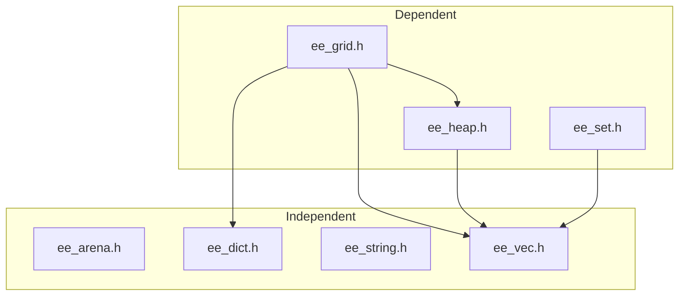

# ee — Lightweight C Utility Library

**ee** is a lightweight, header-only C library that provides **fundamental building blocks** for systems programming and performance-critical applications.

Its goal is to give C developers a **minimal**, **dependency-free toolkit** with APIs inspired by higher-level languages, while preserving the full control and efficiency of plain C.

### **Features**:
- **Memory management** — fast arena allocator.
- **Dynamic containers** — resizable vectors and hash maps.
- **String utilities** — built on top of the vector type.  

### **Key characteristics**:  
- **Header-only** — just include the headers, no build system integration needed.  
- **Portable** — standard C11 with optional SIMD optimizations for modern CPUs.  
- **Low-overhead** — designed for performance and cache efficiency  
- **Extensible** — easy to integrate into existing projects.  

### **Use cases**:  
- Game engines and real-time simulations  
- Embedded systems and firmware  
- High-performance tools and utilities  
- Prototyping and small C projects

### **Installation**:

There are two ways to use **ee** in your project:

- **Clone the repository**

Clone or download the repository and add the ```lib/``` directory to your include path.
This way you get access to all modules at once:

```bash
git clone https://github.com/eesuck1/eelib.git
```

Then in your code:

```c
#include "ee_vec.h"
#include "ee_dict.h"
#include "ee_string.h"
#include "ee_arena.h"
```

- **Copy specific headers**

Since **ee** is header-only, you can also copy a single header (or a subset) into your project.

> [!IMPORTANT]  
> Some headers depend on others, so make sure you copy all required files.



| Header        | Description                                                                                       | Dependencies                          |
|---------------|---------------------------------------------------------------------------------------------------|---------------------------------------|
| `ee_arena.h`  | Provides a fast, linear memory allocator.                                                         | Independent.                           |
| `ee_dict.h`   | An open-addressing hash map designed for fixed-size keys and values.                              | Independent.                           |
| `ee_string.h` | Provides string types for C, supporting dynamic allocation, fixed-size strings, and string views. | Independent.                           |
| `ee_vec.h`    | A dynamic, contiguous array for arbitrary element sizes. Provides fast insertion, deletion, and random access. Supports growing capacity automatically when needed.      | Independent.                           |
| `ee_grid.h`   | Provides a 2D grid structure with utilities for subregions and pathfinding.                        | Depends on `ee_vec.h`, `ee_dict.h`, `ee_heap.h`.  |
| `ee_heap.h`   | Implements a binary heap (priority queue) on top of the dynamic vector with custom comparison.     | Depends on `ee_vec.h`.                            |
| `ee_set.h`    | Implements a set data structure using nodes and vectors, supporting a Red-Black tree layout.       | Depends on `ee_vec.h`.                            |
